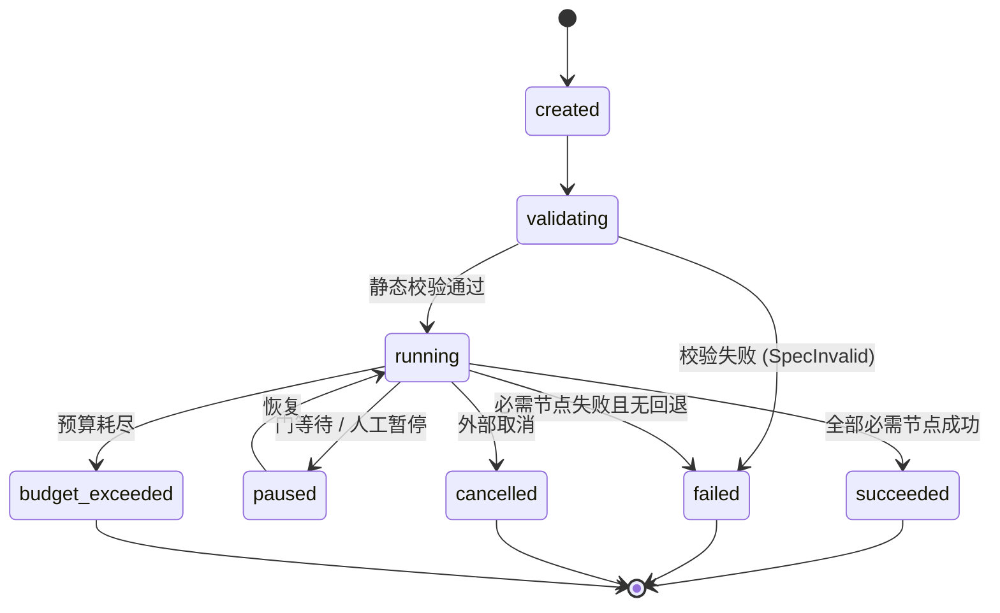
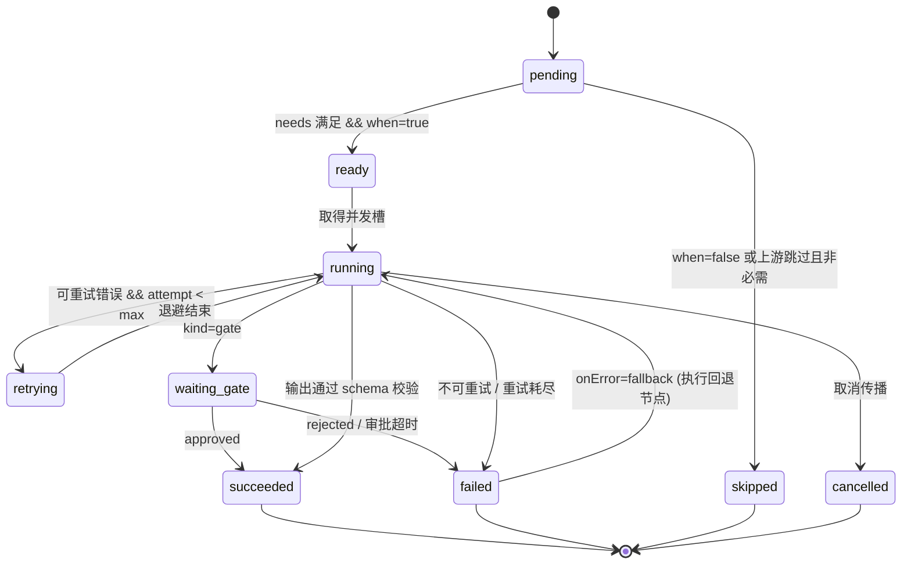

# 02 · 执行语义

> 本文定义 Plan 如何被执行：状态机、调度、数据传递、失败处理、检查点与确定性。
> 所有行为对 [01 DSL](01-dsl.md) 的规范负责；Scheduler 只消费内核 IR（Plan），不感知糖语法。

## 1. 运行状态机



| 状态 | 终态 | 可恢复 | 说明 |
|---|---|---|---|
| `created` | | ✅ | 已受理，未校验 |
| `validating` | | ✅ | 编译期校验（[01 §8](01-dsl.md#8-静态校验规则)） |
| `running` | | ✅ | 调度中 |
| `paused` | | ✅ | 等待门决议或人工介入；**检查点已落盘** |
| `succeeded` | ✅ | ❌ | 所有必需节点成功 |
| `failed` | ✅ | ❌ | 失败关闭；无部分成功语义（除非显式 `optional`） |
| `cancelled` | ✅ | ❌ | 取消传播完成 |
| `budget_exceeded` | ✅ | ❌ | 预算硬停；与 `failed` 区分以便告警 |

> `budget_exceeded` 是**独立终态**而非 `failed` 的子类：前者是治理决策，后者是执行错误，两者的告警与重试策略不同（前者不应自动重试）。

## 2. 节点状态机



**终态**：`succeeded` / `failed` / `skipped` / `cancelled`。调度只依赖终态与 `join` 策略。

## 3. 调度

### 3.1 就绪判定

```
ready(n) ≡ state(n) = pending
        ∧ joinSatisfied(n)
        ∧ whenTrue(n)
        ∧ ∀u ∈ needs(n): state(u) ∈ 终态

joinSatisfied(n):
  all       → ∀u ∈ needs(n): state(u) = succeeded ∨ (state(u) = skipped ∧ u.optional)
  any       → ∃u ∈ needs(n): state(u) = succeeded
  quorum:k  → |{u : state(u) = succeeded}| ≥ k
```

`whenTrue(n)`：对 `when` 表达式求值。**求值失败（引用缺失、类型错误）视为 `false`**，并发出 `WhenEvaluationFailed` 警告——因为 `when` 的常见用途正是「上游失败则跳过」。

### 3.2 调度循环

```
while ∃ 非终态节点:
    if 全局预算耗尽: → budget_exceeded; break
    if 取消已请求:    → cancelled; break
    R ← { n : ready(n) } 按 §3.3 排序
    if R = ∅ ∧ 无非终态可推进节点:
        if ∃ 处于 waiting_gate: → paused
        else: → failed (DeadlockDetected)      # 校验应已排除，属运行时兜底
    for n in R (受并发槽约束):
        acquire(slot); dispatch(n)             # 非阻塞
    await 任一节点进入终态 或 取消/超时事件
```

### 3.3 确定性排序

**同一输入与同一日志必然产生同一调度顺序**（原则 P3）。就绪集排序键：

```
sort key = (拓扑层级升序, 节点 id 字典序)
```

- **拓扑层级**：节点到最近入口的最长路径长度。层级小的先跑，保证依赖尽早释放。
- **id 字典序**：消除哈希/遍历顺序带来的非确定性。
- **不使用**：完成时间、并发槽可用性、注册顺序——这些会引入非确定性。

> 作者可控优先级（`policy.priority`）是明确的**延期项**（[07 §3](07-roadmap.md#3-开放问题)）：它会让排序依赖人工调参，且与「确定性」目标存在张力。v1 不提供。

### 3.4 并发

- **全局并发**：`budget.maxConcurrency`（信号量）。
- **节点级并发**：`forEach.concurrency`、`parallel.concurrency`，取与全局信号的交集。
- **模式级并发**：`inline` 节点串行（共享编排者上下文，不可并行）；`subagent`/`delegate` 可并行。
- **超额请求**：不排队等待无限时间——排队时长计入节点 `timeout`，避免饥饿掩盖死锁。

### 3.5 公平性

长任务不得饿死短任务。就绪集按层级推进天然提供了阶段公平；同一层级内按 id 字典序，保证**同一层级的所有节点都会在其下一层开始前被派发**（受并发槽限制时按序补齐）。

## 4. 上下文契约（核心）

> **原则 P1：图即上下文契约。** 节点只能看到它声明的输入。

这是 Nexus 与「把技能目录丢给模型自己决定」的根本区别。各模式可见范围：

| 可见内容 | `inline` | `subagent` | `delegate` |
|---|---|---|---|
| 技能正文（`skill.get(name).content`） | ✅ 注入当前步骤 | ✅ 注入子 Agent 初始上下文 | ✅ 同 subagent |
| 声明输入（`with` 渲染结果） | ✅ | ✅ | ✅ |
| 编排者的完整对话历史 | ✅（共享） | ❌ | ❌ |
| 兄弟节点的输出 | ❌（除非经 `with` 显式传入） | ❌ | ❌ |
| 其他技能正文 | ❌ | ❌ | ❌ |
| Flow 的 `inputs` | 仅经 `with` | 仅经 `with` | 仅经 `with` |
| 追加系统指令 | — | `agent.instructions` | `agent.instructions` |

**子 Agent 初始上下文 = 基础系统提示 + `agent.instructions` + 技能正文 + 渲染后的输入。**

三种模式对上下文的影响：

- `inline` **零交接损失**，但会污染编排者上下文：技能正文与中间产物都留在历史里。适合短、低 token、强耦合的步骤。
- `subagent` **上下文经济**：子 Agent 消化大量原始材料，只把结构化信封交回。代价是**交接损失**——没写进 `outputs` 的信息就丢了。
- `delegate` 在 `subagent` 之上叠加独立模型与工具策略，用于需要专门能力或受限权限的步骤。

### 4.1 交接损失的缓解

交接损失是多智能体最主要的失败源（[04 §7](04-multi-agent.md#7-失败模式)）。缓解手段：

1. **输出 schema 显式化**：`outputs` 不是文档，是**契约**。声明了就必须产出。
2. **允许携带 `notes` 与 `openQuestions`**（[04 §3](04-multi-agent.md#3-结果信封)）：给子 Agent 一个低成本表达「我发现但没地方放」的通道。
3. **引用与工件**：原始材料以工件引用形式回传，编排者可按需取用，不必全量内联。
4. **schema-repair 重试**：输出不合规时给一次修复机会，而非直接失败。

### 4.2 输入渲染与溢出

渲染后的输入若超过阈值（缺省 32 KiB 或 8k token），执行器**自动溢出为工件引用**：内联一个预览 + `artifact://` 引用，并告知子 Agent 可用读取工具取全文。

溢出是**执行器行为**，不需要作者声明；但作者可用 `x-nexus-artifact: true` 强制某字段始终按引用传递。

## 5. 数据传递与工件

### 5.1 端口不可变

节点输出一经写入即为**不可变**。下游只能读，不能改。这消除了「谁改了这个值」的调试噩梦，并让检查点可以安全地只记录引用。

### 5.2 内容寻址

```
Artifact {
  name:       string
  uri:        "artifact://sha256:<hex>"
  mediaType:  string
  bytes:      integer
  sha256:     string
  producer:   nodeId
  createdAt:  timestamp
}
```

- 相同内容只存一份（天然去重）；
- 恢复时可按 sha256 校验完整性；
- 工件存储是可插拔接口（[06 §5](06-reference-impl.md#5-存储接口)）。

### 5.3 内联阈值

| 载荷大小 | 传递方式 |
|---|---|
| ≤ 阈值（缺省 32 KiB） | 内联为 JSON 值 |
| > 阈值 | 工件引用 + 预览（截断标记） |
| `x-nexus-artifact: true` | 始终引用 |
| 二进制/多媒体 | 始终引用 |

阈值可按 Flow 配置（`spec.defaults.inlineThreshold`）。

### 5.4 `items` 与部分成功

`forEach` 的 `reduce` 拿到的是**成功实例输出的有序数组** `items`。失败实例被排除，但通过 `nodes.<forEachId>.failures` 可访问失败清单。这使「部分成功」可被显式处理，而不是被静默丢弃。

## 6. 失败语义

### 6.1 错误分类

| 错误类 | 触发 | 缺省可重试 | 缺省去向 |
|---|---|---|---|
| `SpecInvalid` | 编译期校验失败 | ❌ | 运行不启动 |
| `SkillNotFound` | 静态引用不可解析 | ❌ | 失败（`onMissing: route` 时改走路由） |
| `SkillLoadFailed` | 技能正文读取失败 | ✅ | 重试 → 失败 |
| `InputValidationFailed` | 输入不满足目标 schema | ✅ | 重试 → 失败 |
| `OutputSchemaViolation` | 输出不满足 `outputs` | ✅（1 次修复） | schema-repair → 失败 |
| `ExecutorError` | 执行器内部错误 | ✅ | 重试 → 失败 |
| `Timeout` | 节点超时 | ✅ | 重试 → 失败 |
| `PolicyDenied` | 权限越界 | ❌ | 失败（**不重试**，重试无意义且危险） |
| `ApprovalRejected` | 人工拒绝/审批超时 | ❌ | 失败 |
| `BudgetExceeded` | 预算硬停 | ❌ | 运行终止 |
| `Cancelled` | 外部取消 | ❌ | 运行终止 |
| `LoopNotConverged` | 达 `maxIterations` 未收敛 | — | **警告，非错误**；节点成功且 `converged: false` |

### 6.2 `onError` 语义

| 取值 | 行为 |
|---|---|
| `fail`（缺省） | 节点 `failed`；下游按 `join` 判定；Flow 通常失败 |
| `continue` | 节点 `failed` 但**不阻塞**下游；下游须处理缺失（`nodes.<id>.status != 'succeeded'`） |
| `fallback:<nodeId>` | 执行回退节点，其输出**替代**原节点输出；原节点记为 `failed`，回退记为 `succeeded` |

### 6.3 失败关闭（原则 P4）

以下情况**绝不静默降级**：静态校验失败、权限越界、预算超限、审批超时、输出 schema 不合规（修复后仍不合规）。

**唯一的失败开放点是显式声明的** `onError: continue` 与 `optional: true`——它们必须由作者写下，且会在审计报告中标记。

### 6.4 重试

```yaml
retry:
  max: 2
  backoff: exponential      # fixed | exponential
  base: 2s
  max: 60s
  jitter: true
  retryOn: [Timeout, ExecutorError]     # 缺省取 §6.1 的「缺省可重试」集合
```

- **退避**：`fixed → base`；`exponential → min(max, base × 2^(attempt-1))`；`jitter` 加 ±25% 抖动避免惊群。
- **重试粒度是节点**，不重跑上游。上游产物从工件存储读取。
- **`attempt` 在绑定时可见**，可用于给重试附加反馈（如把上次错误喂回去）。
- **重试不重置预算**：每次尝试都计费、计时。
- **熔断**：同一技能在窗口内连续失败 N 次后，后续同技能节点直接失败（`SkillCircuitOpen`），避免在系统性故障上烧预算。

## 7. 检查点与恢复

### 7.1 日志（Journal）

**仅追加**事件序列，是恢复与审计的**唯一依据**。

| 事件 | 关键载荷 |
|---|---|
| `RunCreated` | flow name/version、inputs、权限、预算、`planHash` |
| `RunValidated` | planHash、静态校验结论 |
| `RunStarted` | 时间、执行器版本 |
| `NodeReady` | nodeId、拓扑层级 |
| `NodeStarted` | nodeId、attempt、解析后的 SkillRef、渲染输入摘要 |
| `NodeSucceeded` | nodeId、outputs 引用、cost、durationMs |
| `NodeFailed` | nodeId、错误类、message、attempt、stack 摘要 |
| `NodeSkipped` | nodeId、原因（`when=false` / 上游跳过 / 取消） |
| `NodeRetryScheduled` | nodeId、下次 attempt、退避毫秒 |
| `GateWaiting` | nodeId、prompt、preview 引用、超时时刻 |
| `GateResolved` | nodeId、决议、决议人、时间 |
| `RouteDecided` | nodeId、strategy、候选快照 hash、选中项、confidence、rationale |
| `LoopIteration` | nodeId、iteration、carry 摘要、until 结果 |
| `ArtifactWritten` | uri、sha256、bytes、producer |
| `BudgetCharged` | 维度、增量、剩余 |
| `RunPaused` / `RunResumed` | 原因、时间 |
| `RunSucceeded` / `RunFailed` / `RunCancelled` | 终态原因、总成本 |

**日志性质**：

- **单调序号**：`seq` 严格递增，恢复时校验无缺口。
- **哈希链**：每个事件含 `prevHash`，可检测篡改（审计要求）。
- **幂等写入**：同一 `(runId, seq)` 重复写入是安全的。
- **可插拔**：文件、数据库、会话存储均可（[06 §5](06-reference-impl.md#5-存储接口)）。

### 7.2 恢复算法

```
1. 载入日志，校验哈希链与序号连续性；重建节点状态与预算计数
2. 对每个非终态节点：
     running  → 崩溃时状态未知：
                  - 有 idempotencyKey 且工件已存在 → 视为 succeeded（复用工件）
                  - replay = if-missing 且输出工件存在 → succeeded
                  - 否则 → pending（重跑）
     retrying → pending
     waiting_gate → waiting_gate（不重放审批请求）
     ready/pending → pending
3. 从 §3.2 调度循环继续
```

**恢复不重放已成功节点**，除非 `replay: always`（用于技能正文已变更、需强制重算的场景）。

### 7.3 幂等

有副作用的节点（写文件、发请求、改数据库）**必须**声明 `idempotencyKey`：

```yaml
policy:
  idempotencyKey: "${ run.id }:implement:${ nodes.pick.outputs.selected[0].name }"
```

执行器在派发前以该键查询「已完成副作用」记录；命中则跳过实际执行、直接复用记录的输出。这是**编排层能提供的唯一副作用保护**——真正的业务幂等仍由技能自身保证（v1 不做补偿事务，见 [00 §7](00-overview.md#7-非目标)）。

## 8. 确定性与录制回放

### 8.1 两级确定性

| 层级 | 保证 | 手段 |
|---|---|---|
| **调度确定性** | 同输入 + 同日志 → 同调度顺序 | §3.3 确定性排序；`when`/`until` 禁随机（[01 §4.3](01-dsl.md#43-函数白名单)） |
| **内容可重放** | 同输入 → 同模型输出 | 录制/回放模式 |

### 8.2 三种模式

| 模式 | 行为 | 用途 |
|---|---|---|
| `live` | 正常调用模型 | 生产 |
| `record` | 调用模型，并把请求/响应对存为工件 | 采集回归样本 |
| `replay` | 不调用模型，按 `(nodeId, attempt, requestHash)` 命中录制 | 调试、CI、审计复现 |

`replay` 未命中时**失败关闭**（不静默回落到 live），避免「以为是重放实际是新调用」的审计漏洞。

### 8.3 路由决策的可复现

路由决策作为 `RouteDecided` 事件记录，含**候选快照 hash**（catalog 版本）。重放时优先使用记录的决策，而非重新路由——因为 catalog 可能已变。

## 9. 取消与超时

### 9.1 超时层级

```
Flow 剩余时间 = budget.maxWallClock − 已用
节点有效超时   = min(policy.timeout, Flow 剩余时间)
子流程预算     = min(子流程声明, 父级剩余)      # 单调不扩张
```

### 9.2 取消传播

1. 取消请求置位 `run.cancelRequested`；
2. 停止派发新节点；
3. 向运行中节点发协作式取消信号（子 Agent 的 abort）；
4. **宽限期**（缺省 10s）等待协作退出；
5. 超期则强制终止执行器，节点记 `cancelled`；
6. 已完成节点的工件保留（供后续分析）。

`inline` 节点的取消即中断当前模型步；`subagent` 节点的取消需等待其自身的取消语义生效。

## 10. 可观测性

### 10.1 追踪

- **Trace = Run**：`traceId = runId`。
- **Span = 节点尝试**：`nodeId`、`skill`、`mode`、`attempt`、`topoLevel`。
- **子 Span**：模型调用、工具调用、工件读写。
- **属性**：`route.confidence`、`envelope.confidence`、`cost.tokens`、`retry.count`、`gate.waitMs`。

### 10.2 指标

| 指标 | 用途 |
|---|---|
| `node.duration`（按 skill/mode 分） | 发现慢技能 |
| `node.retry.count` / `node.failure.rate` | 稳定性 |
| `route.confidence` 分布 + `route.abstain.rate` | 路由质量（[03 §10](03-routing.md#10-评估)） |
| `gate.waitMs` / `gate.reject.rate` | 审批瓶颈 |
| `budget.consumed` 按维度 | 成本归因 |
| `loop.iterations` 分布 | 收敛性 |
| `envelope.schema.repair.count` | 输出契约质量 |
| `deadlock.detected` | 应为 0；非 0 即校验器漏检 |

### 10.3 日志分级

`RunCreated`/`NodeSucceeded` 等为 **info**；重试、部分失败、`LoopNotConverged` 为 **warn**；失败、预算超限、`PolicyDenied`、死锁为 **error**。审计视图以 Journal 为准，不以应用日志为准。

## 11. 与 DSL 的边界

本文描述的是**运行时语义**。以下属编译期，不在此文档范围：

- 糖语法降级规则 → [01 §10.1](01-dsl.md#101-降级规则汇总)
- 18 条静态校验规则 → [01 §8](01-dsl.md#8-静态校验规则)

运行时不重新校验 Plan（信任编译产物），但**仍校验每一次节点输出**（因为输出来自模型，属不可信数据，原则 P6）。
