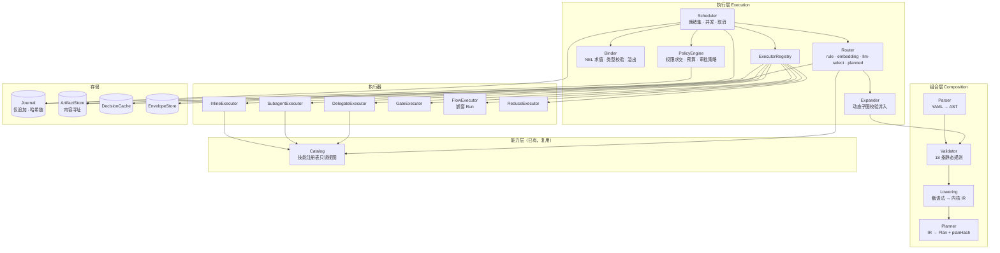
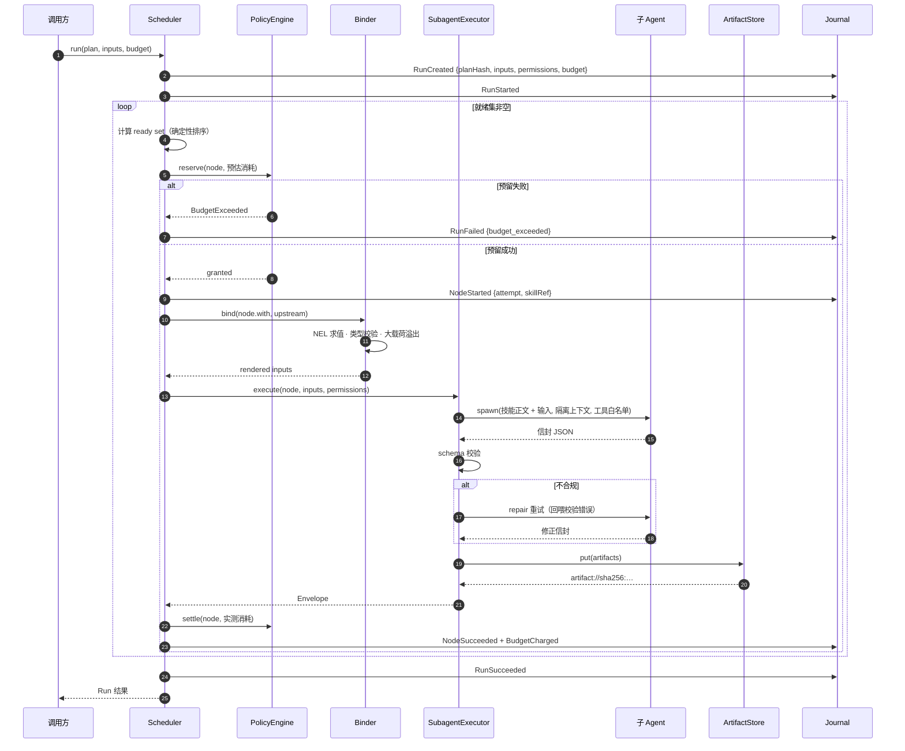
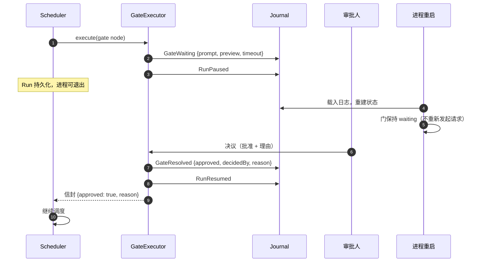
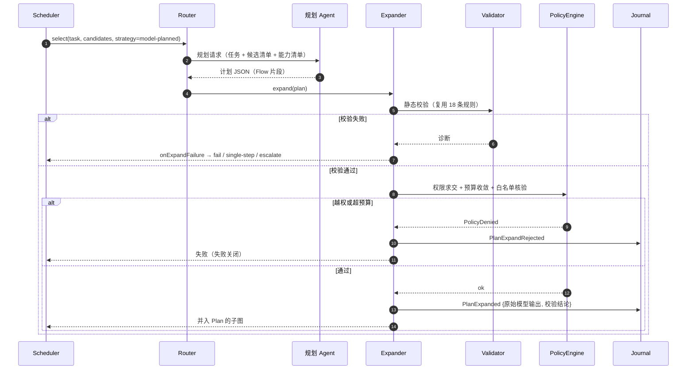

# 06 · 参考实现

> 本文描述 Nexus 的参考实现架构：组件划分、编译流水线、运行时协作、存储接口、扩展点，以及如何绑定到一个真实的技能注册表（以 DeepSeek Harness 为例）。
>
> 规范是语言无关的（[01 DSL](01-dsl.md)）；本文给出一个可落地的实现形状。

## 1. 组件架构



**分层的硬边界**：组合层不执行任何技能；执行层不解析 YAML；能力层不知道 Nexus 的存在。

## 2. 模块职责

| 模块 | 职责 | 不负责 |
|---|---|---|
| **Parser** | YAML/JSON → AST；保留源码位置（行/列）供报错与审计 | 语义校验 |
| **Validator** | 18 条静态规则（[01 §8](01-dsl.md#8-静态校验规则)）；输出结构化诊断（规则号 + 位置 + 修复建议） | 降级 |
| **Lowering** | 糖语法 → 6 种内核节点 + 边；保留 `origin` 回指 DSL 位置 | 解析技能 |
| **Planner** | 权限求交、预算收敛、`planHash` 计算；产出 Plan | 调度 |
| **Scheduler** | 就绪集、确定性排序、并发槽、取消传播、死锁检测 | 执行技能 |
| **Binder** | NEL 求值、类型校验、输入渲染、溢出为工件引用 | 模型调用 |
| **PolicyEngine** | 权限求交、预算预留/结算、审批策略判定 | 执行审批 |
| **Router** | 候选过滤管线 + 策略排序 + 决策缓存 + `RouteDecided` | 执行技能 |
| **Expander** | 动态子图的结构校验、权限/预算收敛、并入 Plan | 生成计划（那是模型的事） |
| **ExecutorRegistry** | `kind` → Executor 映射；内置 6 种，支持 SPI 扩展 | 调度 |
| **Journal** | 仅追加事件、哈希链、重放读取 | 业务语义 |
| **ArtifactStore** | 内容寻址读写、去重、完整性校验 | 权限判定 |

## 3. 编译流水线

```
YAML 文本
   │
   ├─ Parser ────────→ AST（含 sourceMap）
   │                    │
   │                    ├─ 语法错误 → SpecInvalid（含位置）
   │                    ▼
   ├─ Validator ─────→ 18 条规则逐条执行
   │                    │
   │                    ├─ 任一失败 → 拒绝（失败关闭，不产出部分 Plan）
   │                    ▼
   ├─ Lowering ──────→ 内核节点 + 边（糖语法消失）
   │                    │  parallel/forEach/loop/switch/try → 6 种 kind
   │                    ▼
   └─ Planner ───────→ Plan { nodes, edges, permissions∩, budget_min, planHash }
                        │
                        ▼
                    Scheduler
```

**关键性质**：

- **拒绝而非修复**：校验失败即拒绝，不做「尽力修复」。修复会掩盖作者错误。
- **planHash**：Plan 的规范化序列化哈希。它锁定「这一版编排 + 权限 + 预算」，是审计与重放的主键。
- **诊断质量**：每条诊断含规则号、源码位置、期望 vs 实际、修复建议。这是可用性的核心——编排 DSL 的报错体验决定它能否被作者接受。

### 3.1 校验诊断示例

```
error[NX-0006] docs/flows/repo-refactor.yaml:34:14
  `when` 引用了非上游节点 `critique`。
  node: revise
  期望: 仅引用被支配的节点
  实际: nodes.critique.outputs.verdict 在该节点执行时不可用
  修复: 给 revise 添加 `needs: [critique]`，或改用 nodes.design.outputs
```

## 4. 运行时协作

### 4.1 一次 Run 的时序



### 4.2 门等待与恢复



### 4.3 动态子图展开



## 5. 存储接口

```ts
/** 技能注册表的只读视图（能力层适配器）。 */
interface Catalog {
  list(opts: { cwd?: string; signal?: AbortSignal }): Promise<SkillSummary[]>;
  get(name: string, opts?: { cwd?: string }): Promise<SkillDefinition | undefined>;
  /** 目录版本，用于决策缓存键与路由评估绑定。 */
  revision(): Promise<string>;
}

/** 仅追加事件日志；恢复与审计的唯一依据。 */
interface Journal {
  append(event: JournalEvent): Promise<void>;          // 幂等：(runId, seq) 唯一
  read(runId: string, fromSeq?: number): AsyncIterable<JournalEvent>;
  verifyChain(runId: string): Promise<{ ok: boolean; brokenAt?: number }>;
  listRuns(filter?: RunFilter): Promise<RunSummary[]>;
}

/** 内容寻址工件存储。 */
interface ArtifactStore {
  put(bytes: Uint8Array, meta: ArtifactMeta): Promise<Artifact>;
  get(uri: string): Promise<Uint8Array>;
  has(sha256: string): Promise<boolean>;
  stat(uri: string): Promise<ArtifactMeta>;
  gc(policy: GcPolicy): Promise<{ removed: number; bytes: number }>;
}

/** 路由决策缓存，键含 catalogRevision 与模型版本。 */
interface DecisionCache {
  get(key: string): Promise<RouteDecision | undefined>;
  put(key: string, value: RouteDecision, ttl?: Duration): Promise<void>;
}

/** 可注入时钟：确定性测试与重放需要可控时间。 */
interface Clock {
  now(): Date;          // 墙钟（日志时间戳）
  monotonic(): number;  // 单调毫秒（预算与超时）
}

/** 模型调用录制/回放。 */
interface ModelRecorder {
  mode: 'live' | 'record' | 'replay';
  call(req: ModelRequest): Promise<ModelResponse>;   // replay 未命中 → 失败关闭
}
```

**实现要求**：

| 接口 | 要求 |
|---|---|
| `Journal` | 必须支持崩溃后从任意 `seq` 重放；必须能校验哈希链 |
| `ArtifactStore` | 必须内容寻址；`put` 幂等；支持 GC |
| `Catalog` | 必须暴露 `revision`（否则决策缓存无法失效） |
| `Clock` | 生产用系统时钟；测试注入假时钟 |
| `ModelRecorder` | `replay` 未命中**必须失败**，不得回落 `live` |

## 6. 扩展点（SPI）

| SPI | 用途 | 约束 |
|---|---|---|
| **Executor** | 新增 `kind`（如未来的 `script`） | 必须实现权限检查与信封产出；必须支持取消 |
| **Router strategy** | 新增路由策略 | 必须是纯函数（无副作用）；必须返回候选 + 置信度 |
| **Catalog adapter** | 对接非注册表来源 | 只读；须提供 `revision` |
| **Journal backend** | 文件/数据库/远程 | 须保证追加幂等与顺序 |
| **ArtifactStore backend** | 本地/对象存储 | 须内容寻址 |
| **Policy hook** | 组织级策略（如「生产环境必须双人审批」） | 只能收紧，不能放宽（单调性） |

> **Policy hook 只能收紧**——这是 SPI 设计中最重要的一条约束。一个能放宽权限的扩展点会让 §5 的全部保证失效。

## 7. 绑定到真实注册表：DeepSeek Harness

Nexus 的能力层不重新发明，直接适配已有的技能子系统。映射如下：

| Nexus 概念 | DSH 对应 | 说明 |
|---|---|---|
| `Catalog` | `ctx.skills`（`@deepseek-ai/dsh-skill`） | `list()` 取候选、`get(name)` 取正文、`skills/change` 事件驱动缓存失效 |
| 目录版本 `revision` | 注册表内部 revision（由 `skills/change` 触发） | 决策缓存键的组成部分 |
| 技能来源优先级 | `dsh-skill-filesystem` 的 rank（project-dsh 100 → bundled 600） | 治理层据此决定来源是否可入白名单（[05 §4.4](05-governance.md#44-技能来源与信任)） |
| 调用策略过滤 | `SkillInvocationPolicy`（`modelInvocable` / `userInvocable`） | 候选过滤管线第 ① 步（[03 §4](03-routing.md#4-候选过滤管线)） |
| 技能正文渲染 | `renderSkillContent` | **复用**，保证 `<skill_content>` 形状在工具路径与注入路径一致 |
| `inline` 执行器 | 宿主当前 agent step 的指令注入 | 复用用户显式调用技能的注入机制 |
| `subagent` 执行器 | DSH subagent（独立会话、独立上下文） | 全新上下文，仅以声明输入为种子 |
| `delegate` 执行器 | subagent + 模型/工具覆盖 | 独立模型与工具策略 |
| `FlowExecutor` | 嵌套 Run（同一调度器，深度 +1） | 预算与权限单调收敛 |
| `GateExecutor` | 审批面（`dsh-authorization` / 客户端审批 UI） | 暂停即持久化；恢复不重发请求 |
| `Journal` | 会话持久化（`dsh-session-persistence` / storages） | 事件序列作为恢复依据 |
| `ArtifactStore` | `dsh-attachment` / 输出溢出（`dsh-spill`） | 大载荷按引用传递 |
| 追踪与指标 | `dsh-session-telemetry` | span = 节点尝试 |
| 权限求交的宿主层 | `dsh-sandbox` / `dsh-fs` | `hostPolicy` 的来源 |
| Flow 的发现 | 类比 `.dsh/skills`，置于 `.dsh/flows/*.yaml` | 复用「项目根 → 用户根 → 内置」的扫描优先级 |
| **Flow 作为 Skill** | `ctx.skills.register({...})` | 把 Flow 的 `description`/`whenToUse` 注册为技能，**无需改动注册表**（[01 §7.1](01-dsl.md#71-flow-作为-skill)） |
| 逃生舱 | `dsh-workflow` 工具 | 见 §7.1 |

### 7.1 与 `dsh-workflow` 工具的分工

DSH 已有 `workflow` 工具：在一次调用内用命令式 JavaScript 编排多个 subagent。它与 Nexus 不是竞争关系，而是**互补的两种形态**：

| 维度 | `workflow` 工具 | Nexus |
|---|---|---|
| 形态 | 命令式 JS，单次调用内 | 声明式 DSL，可版本化 |
| 生命周期 | 调用结束即结束 | Run 可暂停、恢复、跨进程 |
| 静态校验 | 无（JS 运行时才知道） | 18 条编译期规则 |
| 治理 | 依赖宿主沙箱 | 预算/审批/权限/审计内建 |
| 复用 | 每次重新生成 | Flow 可入库、可评审、可路由 |
| 适用 | 一次性、探索性、高度动态 | 反复使用、需治理、需审计 |

**定位**：`workflow` 是**逃生舱**（原则 P2 的显式降级路径）；Nexus 是**结构化主路径**。一条 Nexus 流程可以在某个节点上调用 `workflow`，把动态性局部化——但该节点会被审计标记为不可静态分析。

### 7.2 落地顺序建议

```
1. Catalog 适配器（包装 ctx.skills，暴露 list/get/revision）
2. Parser + Validator + Lowering（纯函数，可独立测试，无需运行时）
3. Scheduler + InlineExecutor + 内存 Journal（先跑通顺序 Flow）
4. SubagentExecutor + Envelope 校验 + ArtifactStore
5. 持久化 Journal + 恢复
6. Router（先 rule，再 embedding，再 llm-select）
7. GateExecutor + PolicyEngine
8. Expander（model-planned）
9. 录制回放 + 审计导出
```

## 8. 部署形态

| 形态 | 说明 | 适用 |
|---|---|---|
| **库（嵌入）** | 作为进程内库被宿主调用，复用宿主的技能注册表与会话 | 首选；与 DSH 集成 |
| **CLI** | `nexus validate` / `run` / `resume` / `replay` / `eval-routing` | 作者本地、CI |
| **服务** | HTTP/gRPC 暴露 Run API | 多调用方共享编排（v2 再考虑） |

**CLI 命令**：

```bash
nexus validate docs/flows/repo-refactor.yaml      # 静态校验，输出诊断
nexus plan     docs/flows/repo-refactor.yaml      # 打印内核 IR 与 planHash
nexus run      docs/flows/repo-refactor.yaml --input inputs.json
nexus resume   <runId>                            # 从检查点恢复
nexus replay   <runId>                            # 用录制样本重放
nexus eval-routing --dataset routing.jsonl        # 路由评估（03 §10）
nexus audit    <runId> --format md                # 导出审计报告（脱敏）
```

## 9. 测试策略

| 层 | 测试 | 目标 |
|---|---|---|
| **规范** | 18 条校验规则各配正/反例 | 规则无遗漏、诊断准确 |
| **表达式** | NEL 求值器 fuzz + 确定性检查 | 无宿主逃逸；`when` 中禁随机 |
| **降级** | 每种糖语法 → IR 的快照测试 | 降级语义稳定 |
| **调度** | 同输入跑 100 次，断言调度序列完全一致 | 确定性（[02 §3.3](02-execution.md#33-确定性排序)） |
| **恢复** | 故障注入：在任意事件后杀进程，恢复后断言终态一致 | 恢复正确、幂等生效 |
| **契约** | Catalog / Journal / ArtifactStore 接口契约测试 | 后端可替换 |
| **golden flow** | 录制真实 Run，回放断言输出一致 | 回归防护 |
| **路由** | 标注数据集评估 + 回归门禁 | [03 §10](03-routing.md#10-评估) |
| **安全** | 越权用例集（白名单外动态引用、提权子流程、注入样本） | **全部被拦截**；任何漏网即阻断发布 |
| **成本** | 断言预算在超限时确实硬停，且不自动重试 | 治理有效 |

> **安全测试是发布门禁**：越权用例集中的任何一条未被拦截，都不允许发布。

## 10. 实现语言无关性

规范（[01](01-dsl.md)）不依赖任何语言。参考实现的接口形状（§5）以 TypeScript 表达，但语义约束是语言中立的：

- `Journal` 需要**仅追加 + 幂等 + 可重放**——任何有事务日志的存储都能满足；
- `ArtifactStore` 需要**内容寻址**——本地文件、S3、CAS 均可；
- `Catalog` 需要**只读 + 版本**——任何技能注册表都能适配；
- `Executor` 需要**可取消 + 结构化返回**——任何 Agent 运行时都能适配。

因此 Nexus 可以实现在 Python（对接 LangGraph 风格运行时）、Go（对接自研 Agent 服务）或 TypeScript（对接 DSH）。**规范是资产，实现是可替换的。**
